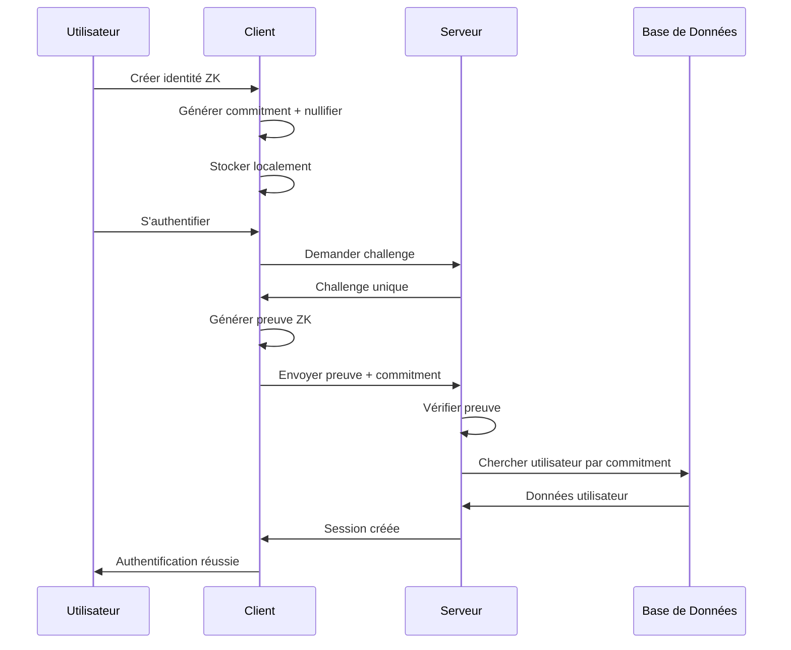

# 🔐 Authentification Zero Knowledge (ZK) - Neosign

## 📋 Vue d'ensemble

Cette implémentation ajoute une solution d'authentification Zero Knowledge à votre application Neosign, permettant aux utilisateurs de s'authentifier de manière sécurisée sans révéler leurs secrets au serveur.

## 🏗️ Architecture

### Composants Principaux

1. **ZKAuth** (`src/lib/zk-auth.ts`)
   - Gestion des identités ZK
   - Génération et vérification des preuves
   - Utilisation des APIs Web Crypto natives

2. **ZKProvider** (`src/lib/zk-provider.ts`)
   - Interface pour l'authentification ZK
   - Gestion des challenges et vérifications

3. **API ZK** (`src/app/api/auth/zk/route.ts`)
   - Endpoints pour l'authentification ZK
   - Gestion des challenges et preuves
   - Intégration avec la base de données

4. **Interface Utilisateur**
   - `ZKLoginForm` : Formulaire d'authentification ZK
   - `ZKInfo` : Affichage des informations ZK dans le dashboard
   - Page dédiée : `/zk-login`

## 🔧 Fonctionnalités

### ✅ Implémentées

- **Génération d'identités ZK** : Création d'identités cryptographiques sécurisées
- **Preuves ZK** : Génération et vérification de preuves Zero Knowledge
- **Authentification sécurisée** : Connexion sans révéler de secrets
- **Stockage local** : Identités stockées localement dans le navigateur
- **Interface utilisateur** : Interface moderne et intuitive
- **Intégration NextAuth** : Provider ZK personnalisé pour NextAuth
- **Base de données** : Stockage des commitments ZK

### 🔒 Sécurité

- **Cryptographie native** : Utilisation des APIs Web Crypto
- **Signatures ECDSA** : Preuves basées sur ECDSA P-256
- **Hachage SHA-256** : Hachage sécurisé des données
- **Challenges uniques** : Génération de challenges aléatoires
- **Stockage local** : Aucune donnée sensible sur le serveur

## 🚀 Utilisation

### Pour les Utilisateurs

1. **Accès à l'authentification ZK**
   - Aller sur `/login`
   - Cliquer sur "Authentification ZK"

2. **Création d'une identité**
   - Cliquer sur "Créer une nouvelle identité ZK"
   - L'identité est générée et stockée localement

3. **Authentification**
   - Cliquer sur "S'authentifier avec ZK"
   - Le système génère une preuve et l'envoie au serveur

4. **Enregistrement**
   - Cliquer sur "S'enregistrer avec cette identité"
   - L'identité est enregistrée dans la base de données

### Pour les Développeurs

#### Ajout du provider ZK à NextAuth

```typescript
import { zkCredentialsProvider } from "@/lib/zk-credentials-provider";

export const authOptions: NextAuthOptions = {
  providers: [
    // ... autres providers
    zkCredentialsProvider,
  ],
  // ... configuration
};
```

#### Utilisation de l'API ZK

```typescript
// Générer un challenge
const response = await fetch("/api/auth/zk", {
  method: "POST",
  headers: { "Content-Type": "application/json" },
  body: JSON.stringify({ action: "generate_challenge" }),
});

// Vérifier une preuve
const verifyResponse = await fetch("/api/auth/zk", {
  method: "POST",
  headers: { "Content-Type": "application/json" },
  body: JSON.stringify({
    action: "verify_proof",
    data: { commitment, proof, challenge },
  }),
});
```

## 📊 Base de Données

### Modèle User étendu

```prisma
model User {
  // ... champs existants
  zkCommitment String? @unique  // Nouveau champ pour les commitments ZK
}
```

### Migration

```bash
npx prisma db push
npx prisma generate
```

## 🔧 Configuration

### Variables d'Environnement

Aucune variable d'environnement supplémentaire n'est requise pour l'authentification ZK.

### Dépendances

```json
{
  "dependencies": {
    "@noble/secp256k1": "^2.3.0",
    "@noble/hashes": "^1.8.0"
  }
}
```

## 🛡️ Avantages de Sécurité

1. **Confidentialité** : Aucun secret n'est transmis au serveur
2. **Intégrité** : Preuves cryptographiques vérifiables
3. **Non-répudiation** : Signatures numériques sécurisées
4. **Résistance aux attaques** : Protection contre les attaques par force brute
5. **Stockage local** : Contrôle total des données sensibles

## 🔄 Flux d'Authentification



## 🧪 Tests

### Test de l'API ZK

```bash
# Test de génération de challenge
curl -X POST http://localhost:3000/api/auth/zk \
  -H "Content-Type: application/json" \
  -d '{"action": "generate_challenge"}'

# Test de vérification de preuve
curl -X POST http://localhost:3000/api/auth/zk \
  -H "Content-Type: application/json" \
  -d '{"action": "verify_proof", "data": {...}}'
```

## 🚀 Déploiement

1. **Migration de base de données**

   ```bash
   npx prisma migrate deploy
   ```

2. **Génération du client Prisma**

   ```bash
   npx prisma generate
   ```

3. **Build de l'application**
   ```bash
   npm run build
   ```

## 🔮 Améliorations Futures

1. **Preuves ZK avancées** : Intégration de circuits ZK complexes
2. **Multi-signatures** : Support pour plusieurs identités ZK
3. **Récupération d'identité** : Mécanismes de récupération sécurisés
4. **Audit trail** : Traçabilité des authentifications ZK
5. **Intégration blockchain** : Stockage des commitments sur blockchain

## 📝 Notes Techniques

- **Compatibilité navigateur** : Requiert les APIs Web Crypto (support moderne)
- **Performance** : Génération de preuves asynchrone
- **Stockage** : Utilise localStorage pour la persistance
- **Sécurité** : Basé sur les standards cryptographiques établis

## 🤝 Contribution

Pour contribuer à l'amélioration de l'authentification ZK :

1. Tester les fonctionnalités existantes
2. Proposer des améliorations de sécurité
3. Optimiser les performances
4. Ajouter de nouvelles fonctionnalités

---

**⚠️ Note de Sécurité** : Cette implémentation utilise des APIs Web Crypto natives pour la sécurité. Assurez-vous que votre navigateur supporte ces APIs pour une utilisation optimale.
